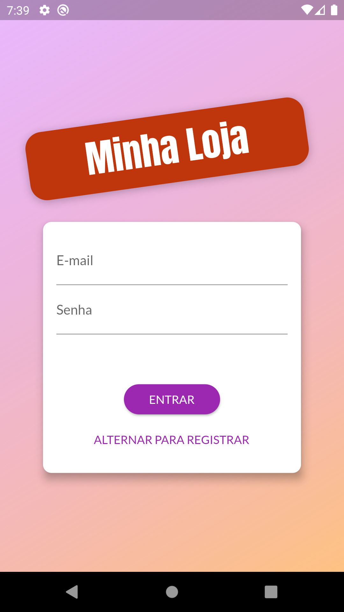
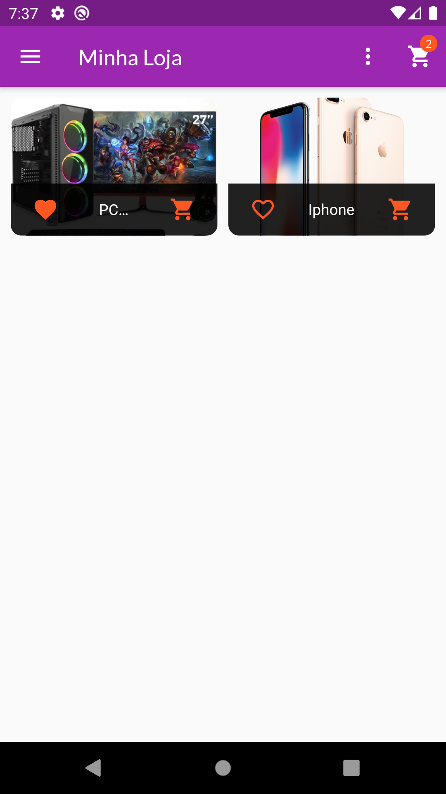
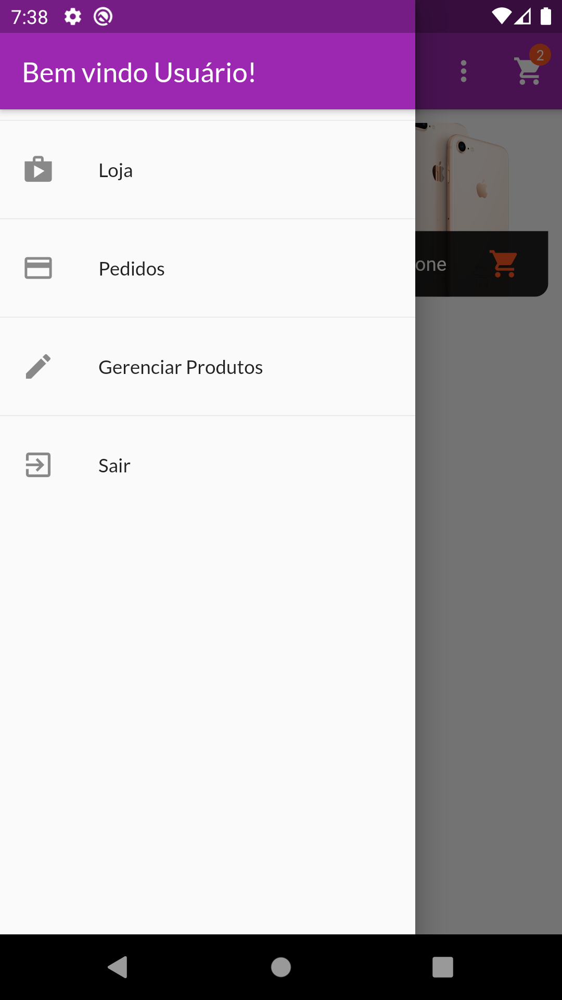
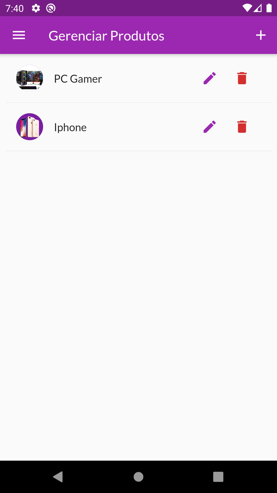

# MyShop Flutter

> Projeto desenvolvido com Flutter que demonstra como trabalhar com gerenciamento de estado, formulários, requisições http, autenticação e animação.

## Project

    
    

    
    

    
    

